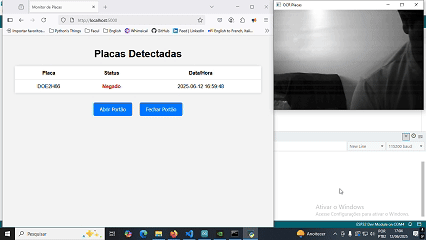
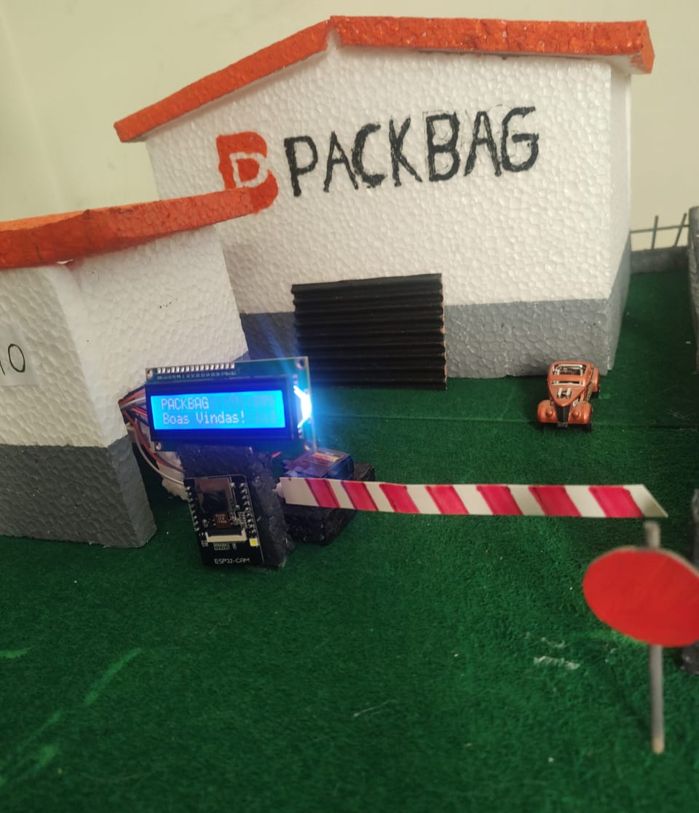
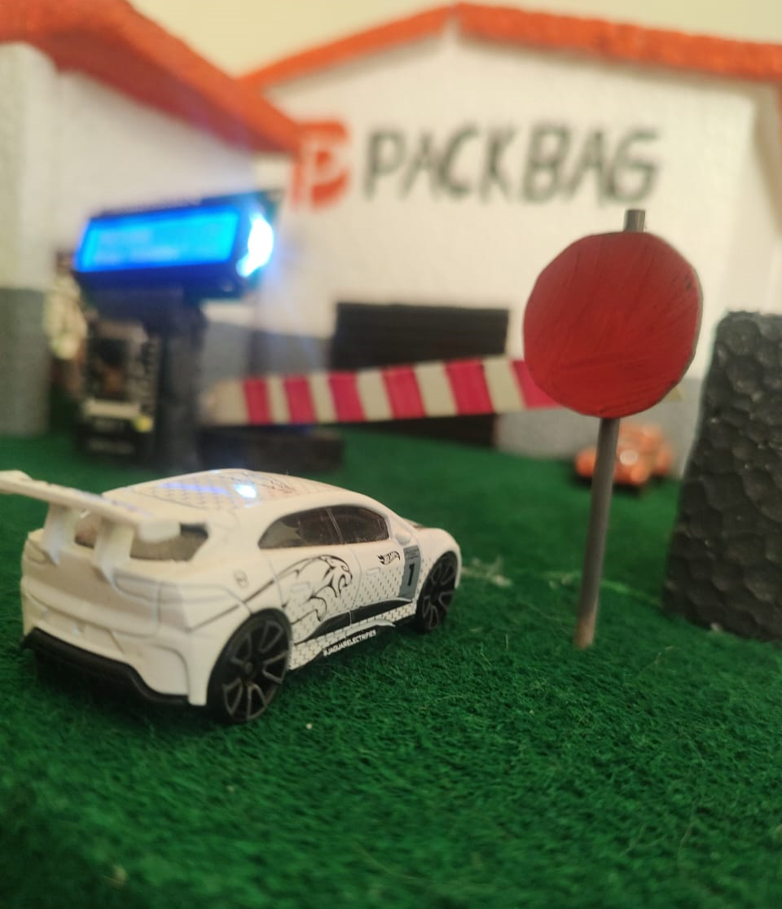
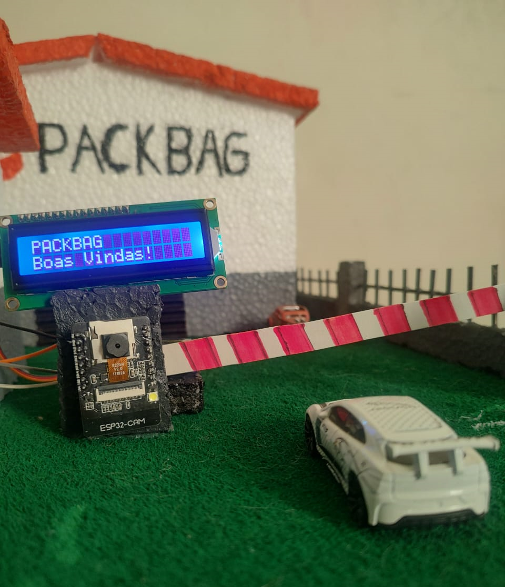
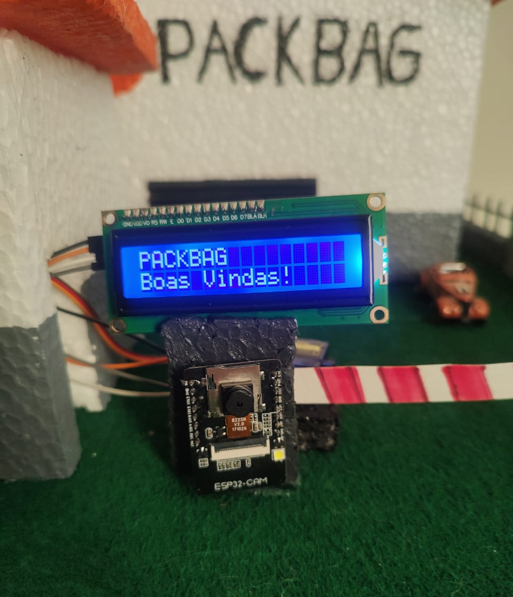
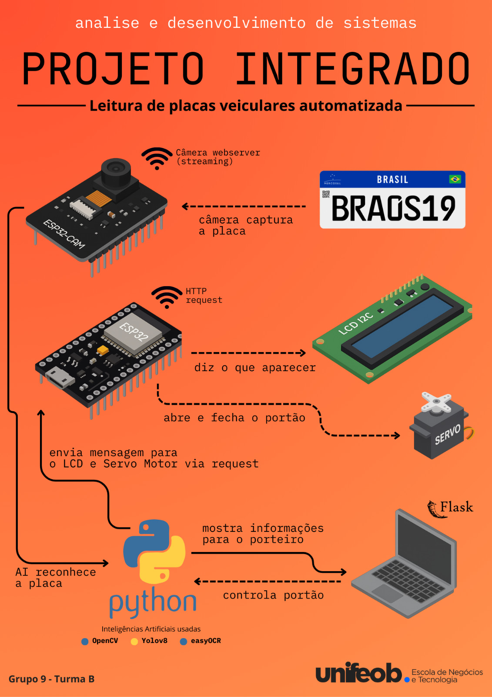

# Vehicle License Plate Reader with AI

[🇧🇷 Leia em Português 🇵🇹](README.md)

An automatic vehicle license plate reading system using computer vision and IoT devices with ESP32 and ESP32-CAM.

<!-- Badges showing the technologies used -->


## 🌟 INTRODUCTION

This project performs real-time vehicle license plate recognition using **computer vision**. Simply connect any streaming-capable camera — via cable or network — and the Artificial Intelligence will automatically recognize the license plates.

The system was developed as part of the **Systems Analysis and Development** course at **UNIFEOB (Centro Universitário da Fundação de Ensino Octávio Bastos)**. It addresses a **real need from the company PackBag**, which sought to automate the control of truck entry and exit.

As a solution, we developed a prototype using **ESP32** and **ESP32-CAM** microcontrollers. For visual detection, we used **OpenCV** and **YOLOv8n**, and **EasyOCR** for license plate text extraction. The project successfully simulates the automation process needed, solving the company's problem.

## 🎯 CONTEXT

The university **UNIFEOB** established a partnership with **PackBag** to support its transformation toward **Industry 4.0**. Through this collaboration, various internal improvement points were identified, which became **real challenges to be solved by students**.

This project emerged within this context, as part of the first bimester's Integrative Project (PI). Among many proposals, our team was responsible for developing a **technological solution to automate the truck entry and exit control** at PackBag's distribution center.

By analyzing companies in the same sector and gathering information from key **personas** (drivers, gate staff, and managers), we identified the main pain points in the operational routine:

* 🔄 Low efficiency in vehicle entry/exit flow
* 👥 Errors in manual truck counting
* 🔓 Security gaps in access control
* 🕒 Recurring logistical delays
* 🐢 Lack of agility in vehicle clearance

Based on this, we developed a solution that not only meets the company's demands but also improves the truck drivers' experience by making the process more agile, secure, and automated.

We focused on creating **functional prototypes** capable of **demonstrating the solution's feasibility** to the company and obtaining its validation. Thus, we chose **ESP32** and **ESP32-CAM**, which offer low cost, wireless connectivity, and are aligned with the content studied in our coursework.

## ⚙ FEATURES

### 📸 Real-time License Plate Reading

Detects vehicles using the ESP32-CAM and uses OpenCV to **identify plates** at the moment of capture.

### 🧠 AI Recognition

Integrates YOLO for vehicle detection and EasyOCR for **character extraction from plates**.

### 📋 Access Logging

Stores **plate data** along with **date and time** in a JSON file *(with future database integration planned)*.

### 🌐 Web Interface

Browser-accessible panel displaying the camera feed and captured records, including:

* Detected plates
* Authorized and unauthorized vehicles
* Detection time
* Clearance time
* Buttons to open and close the gate

### 🚪 Gate Opening Simulation

Controls a **servo motor** connected to the ESP32 to simulate access authorization.

## 🎞 MEDIA

<!-- Photos and GIFs of the project -->











## 💻 TECHNOLOGY STACK

### 🐍 Python

Main backend language. Python acts as the **system administrator**, responsible for capturing images from the camera, processing them through **three AI libraries (OpenCV, YOLOv8n, and EasyOCR)**, and managing communication between microcontrollers and the interface used by the gatekeeper.

### 👁 OpenCV <sub>AI</sub>

Computer vision library used to **read the ESP32-CAM video in real-time**, apply filters, and prepare the images for the next detection steps. It also displays visual markings when a plate is identified.

### 👨‍⚖️ Yolov8n <sub>AI</sub>

AI model responsible for **detecting and locating license plates** in the image. Without YOLO, the system wouldn’t distinguish the plate from the rest of the scene. Uses a pre-trained model called `license_plate_detector.pt`, adapted to recognize various plate patterns worldwide.

### 🆎 EasyOCR <sub>AI</sub>

After plate detection, EasyOCR performs **optical character recognition (OCR)**, converting the image into text. It extracts the license number to check against the database — in our case, the JSON file. Configured to recognize **Brazilian plate formats**, including the old and new MERCOSUL standards.

### 🌐 Flask

Lightweight **web framework** used to create the backend server. It manages **HTTP routes** and serves the web interface, where the gatekeeper can view captures, release statuses, timestamps, and control the gate.

### 👨‍💻 Arduino IDE

Development environment used to **write and upload firmware** to the ESP32 and ESP32-CAM microcontrollers. It also facilitates using the serial monitor to debug and obtain key data like IPs and communication logs.

### ⌨ C/C++

Languages used to program the firmware for ESP32 and ESP32-CAM microcontrollers, defining device behavior efficiently with direct hardware control.

### 🤖 ESP32

Main microcontroller. Responsible for:

* Displaying messages on the **LCD Display** to drivers.
* Controlling the **Servo Motor** that simulates gate opening.
* Powering and communicating with the ESP32-CAM.

ESP32 was chosen for its **higher processing power** and **integrated Wi-Fi connectivity**, offering excellent cost-benefit compared to traditional Arduino.

### 📷 ESP32-CAM

ESP32 version with integrated camera module. Used for **live image capture and streaming** with high performance and support for multiple resolutions. Ideal for low-cost prototyping, this board also includes **webserver support**, making it perfect for embedded real-time streaming systems.

### 🔌 Servo Motor

Electromechanical device used to **simulate gate opening and closing**. Receives signals from the ESP32 and performs precise rotational movements to represent vehicle entry authorization or blocking.

### 📟 LCD I2C Display

Low-power display using the I2C protocol to communicate with the ESP32. Used to **show messages directly to drivers**, such as authorizations, alerts, and quick access instructions.


## 🛠 CONFIGURATION AND INSTALLATION GUIDE

This guide provides instructions to clone the repository, install the required dependencies, set up devices, and prepare the environment to run the system.

### 📅 Cloning the Repository

```bash
git clone https://github.com/GuiMorus/Projeto-Leitor-de-Placas-Veiculares.git
cd Projeto-Leitor-de-Placas-Veiculares
```

---

### 📦 Installing Python Dependencies

> ❌ **IMPORTANT**: If you plan to use PyTorch with CUDA support, install CUDA **before** the dependencies to ensure compatibility.

#### (Optional) Installing PyTorch with CUDA

```bash
pip3 install torch torchvision torchaudio --index-url https://download.pytorch.org/whl/cu128
```

❗ *Check your CUDA version and visit the [PyTorch page](https://pytorch.org/get-started/locally/) to ensure the correct pip install command for your version.*

#### Installing Other Dependencies

It is recommended to create a virtual environment:

```bash
python -m venv venv
source venv/bin/activate  # Linux/macOS
venv\Scripts\activate    # Windows
```

Install the libraries:

```bash
pip install -r requirements.txt
```

---

### ⚡ Hardware Wiring and Connections

* **ESP32 powers ESP32-CAM** via **Vin** (5V) and **GND** (Ground).
* **RX2 (GPIO16)** of ESP32 connected to **TX (UOT)** of ESP32-CAM (Serial communication).
* **TX2 (GPIO17)** of ESP32 connected to **RX (UOR)** of ESP32-CAM (Serial communication).
* **Pin 21 (GPIO21)** of ESP32 -> **SDA** of the LCD display.
* **Pin 22 (GPIO22)** of ESP32 -> **SCL** of the LCD display.
* **Pin 18 (GPIO18)** of ESP32 -> control of the **Servo Motor**.
* ❕ Connection speed: 115200 baud.


> 🔌 The **Servo Motor** and **LCD I2C Display** must be powered by an **external 5V source** independent of the ESP32 and ESP32-CAM.

*Note: our team made an adapter by cutting a USB cable and using the red wire (5V) and black wire (GND) to connect separately to the breadboard. The USB is connected to a computer port to provide the required energy and amperage.*

---

### 🌐 Network Connectivity

To ensure proper system operation:

* The **ESP32**, **ESP32-CAM**, **api\_flask.py**, and **main.py** must be on the **same Wi-Fi network**.
* The ESP32 IP will appear on the **LCD display** and **Serial Monitor**.
* The ESP32-CAM IP will appear in the **Serial Monitor** after boot.

> ⚠️ **IMPORTANT**: Be sure to update the IP addresses in the code variables, or the project will not function.
>
> * In **main.py** update the **ESP32-CAM IP on line 12**.
> * In **main.py** update the **ESP32 IP on line 13**.
> * In web > **index.html**, update the **ESP32 IP on line 27**.
> * In code > ESP32\_LCD > **ESP32\_LCD.ino**, update **SSID and Password on lines 7 and 8**.
> * In code > ESPCAM\_CameraWebServer > **ESPCAM\_CameraWebServer.ino**, update **SSID and Password on lines 31 and 32**.

---

Done! Your environment is now set up to run the code efficiently. The next section provides usage instructions and examples.

## 🚀 USAGE INSTRUCTIONS

After assembling the circuit and installing the required libraries and dependencies, it's time to run the project! Follow the steps below by module:

### 🔧 Setting Up the ESP32

1. **Open Arduino IDE** and configure the ESP32 board:

   * Go to:
     `File > Preferences > Additional Boards Manager URLs`
     Add this URL:
     `https://raw.githubusercontent.com/espressif/arduino-esp32/gh-pages/package_esp32_index.json`

2. **Install the required libraries** in Arduino IDE:

   * `LiquidCrystal I2C` (by *Frank de Brabander*)
   * `ESP32Servo` (by *Kevin Harrington, John K. Bennett*)

3. **Install the ESP32 board** via:
   `Tools > Board > Boards Manager`
   Search for **ESP32** and install the Espressif and Arduino libraries.

4. **Connect ESP32 to the computer** via USB.

5. In:
   `Tools > Board`, select: **ESP32 Dev Module**
   In:
   `Tools > Port`, select the **correct COM port**.

6. **Open and upload the code**:

   ```
   ./Projeto-Leitor-de-Placas-Veiculares/code/ESP32_LCD/
   ```

---

### 📷 Setting Up the ESP32-CAM

> ⚠️ The library depends on your ESP32-CAM model. The provided code is generic but can be adjusted as needed.

1. **Connect your ESP32-CAM to the PC using a USB-serial adapter.**

2. In Arduino IDE:

   * Go to `File > Open`
   * Select the folder:

     ```
     ./Projeto-Leitor-de-Placas-Veiculares/code/ESPCAM_CameraWebServer/
     ```

3. Select the correct board (usually: **AI Thinker ESP32-CAM**)
   and the **correct COM port**, then upload the code.

---

### 🌐 Starting the Flask API

1. Open your terminal (CMD, PowerShell, or bash).

2. Navigate to the project root folder:

   ```bash
   cd Projeto-Leitor-de-Placas-Veiculares
   ```

3. Run the Flask server:

   ```bash
   python api_flask.py
   ```

---

### 🚀 Final Steps to Run the System

1. **Power the devices** (Servo Motor and LCD Display).

2. **Connect ESP32 USB** to the PC.

3. **Check the IPs in the Arduino Serial Monitor** (baud rate: **115200**):

   * ESP32 IP appears on the LCD Display and Serial Monitor.
   * ESP32-CAM IP is also displayed.

4. **Access ESP32-CAM IP** in your browser:

   * Configure **resolution**, **quality**, and **filters**.
   * ⚠️ Recommended: use **grayscale filter** to improve AI reading.
   * After configuration, click **"Stop Stream"** to avoid conflicts with `main.py`.

5. **Run the main script**:

   ```bash
   python main.py
   ```

6. **Access the Web Interface** in your browser:

   ```
   http://localhost:5000/
   ```

   Here you can view:

   * Real-time detected plates.
   * Vehicle access status.
   * Detection timestamps.
   * Buttons to open/close the gate remotely.

## 💡 Usage Examples

Below are some scenarios demonstrating how the system can be used in real or simulated environments:

### 🚛 Authorized Truck Entry

1. Truck approaches the company entrance.
2. Camera (ESP32-CAM) detects the vehicle and streams video.
3. YOLO system identifies and crops the plate.
4. EasyOCR interprets the plate characters.
5. System checks the plate against a JSON whitelist.
6. **If the plate is authorized**:

   * Servo motor simulates gate opening.
   * "Access granted" message appears on LCD.
   * Event logged with timestamp.
   * Web interface displays plate, status, and options.

---

### ❌ Unauthorized Vehicle

1. Vehicle is normally detected.
2. Plate is successfully read.
3. Database check **finds no match**.
4. Gate **remains closed**.
5. LCD displays "Access denied".
6. Event logged as an access attempt.
7. Web interface shows rejected plate and allows manual action.

---

### 🧪 Test / Simulation Scenario

Perfect for academic demos or business presentations.

1. System runs in simulation mode (with ESPs connected but no real traffic).
2. System tested using recorded videos or camera simulation.
3. Can demonstrate:

   * Real-time visual detection.
   * OCR reading accuracy.
   * Gate automation with servo motor.
   * Web interface with logs and controls.

---

### 🕵️‍♂️ Fleet Monitoring

1. Company wants to track all truck entries and exits.
2. System logs all detected plates, even unauthorized ones.
3. JSON can be exported or linked to a database for reports.
4. Helps track schedules and movements.

## 📈 CONCLUSIONS

This has been the biggest project I’ve developed so far *(June/2025)* — and definitely one of the most challenging. I was thrilled when I joined college and learned we'd create different projects each semester. I'm a hands-on person, and everything exceeded my expectations when I found out the project would solve a **real need for a real company**.

I’ve been studying **Python** for a while, and this project finally let me apply it to **Artificial Intelligence**. I spent days and nights adjusting every part of the system: coding, testing, fixing errors until reaching the final version.

Besides diving into the **IoT world** and learning how to transform a company into Industry 4.0, teamwork was essential. I got ideas, support, and help to make decisions, design the interface in Figma, document everything, and present a full MVP to **Pack Bag**. Without my team, I’d probably still be assembling the prototype!

After a lot of effort, research, and conversations with users to understand their needs, we developed what we wanted: **a fully offline AI-powered Vehicle License Plate Reader**, built from scratch. We met the company’s requirements, presented the solution, and got excellent feedback on its feasibility.

## 🤝 AUTHORS

Presenting the members of **Group 9 - Class B at UNIFEOB 2025** who made this project a reality.

### Guilherme Moreira (myself)

* Python development lead.
* Integration between AI components.
* Microcontroller operations (ESP32 and ESP32-CAM).
* Helped build the prototype.

> [GitHub](https://github.com/GuiMorus)
> [LinkedIn](https://www.linkedin.com/in/gui-msilva/)

---

### Ester de Lima Machado

* Edited videos and media images.
* Helped assemble the hardware.
* Contributed to the prototype.

> [LinkedIn](https://www.linkedin.com/in/exxther/)

---

### Helloisa Dias Francisco

* Presented the project to Pack Bag.
* Produced documentation and research.
* Scripted the podcast and final presentation.
* Helped build the prototype.

---

### Maria Fernanda de Almeida

* Group leader.
* Designed the interface and Figma prototype.
* Organized team tasks via Trello.

---

### Sandy de Souza Lima

* System logistics.
* Hardware assembly assistance.
* Prototype contributor.

---

### Vitória Kamilly da Silva Oliveira

* Final editing and formatting of documents (ABNT standards).
* Organized official documentation and academic deliverables.
* Helped with the interface and Figma prototype.

## 🙏 ACKNOWLEDGMENTS

I want to thank my team, who supported the entire structure and pushed through all challenges. Thanks for putting up with my breakdowns, audio rants, and desperation over bugs. 😆

Thanks to **UNIFEOB** for the amazing experience, and to **Pack Bag** for the opportunity to work on real solutions with real-world impact.

This project was extremely enriching. I learned a lot in a short time and dedicated myself to creating a fully functional system, with room for improvements and practical application.

Thanks also to the **IoT module instructors**, who guided us, found what we needed, and were always available to help.

Finally, thank **you** — for taking the time to learn about this project. I hope it inspires your own studies, helps your projects, or leads to something even greater.

**Thank you all so much!**
