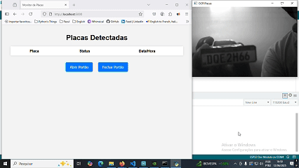
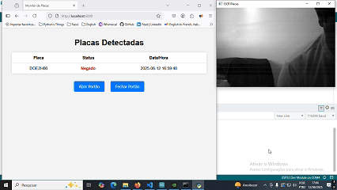
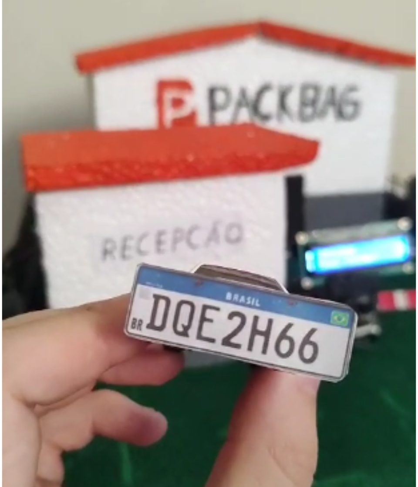
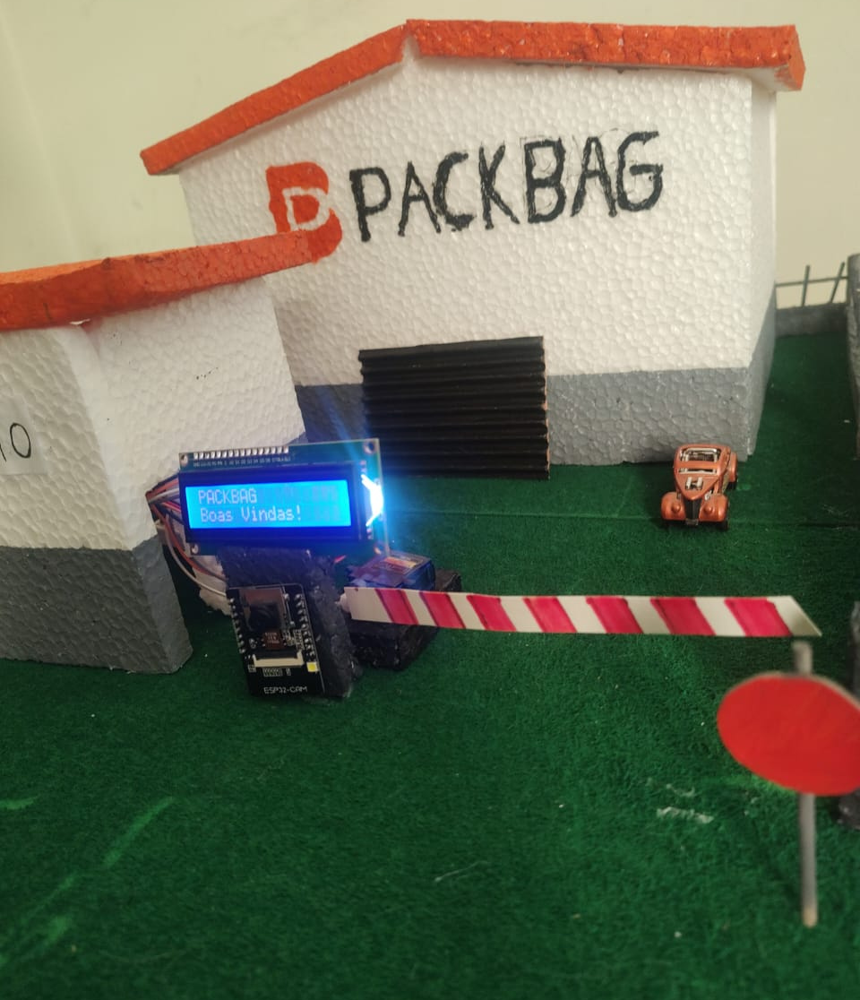
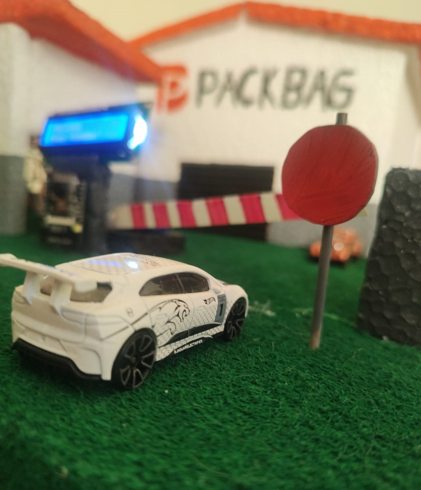
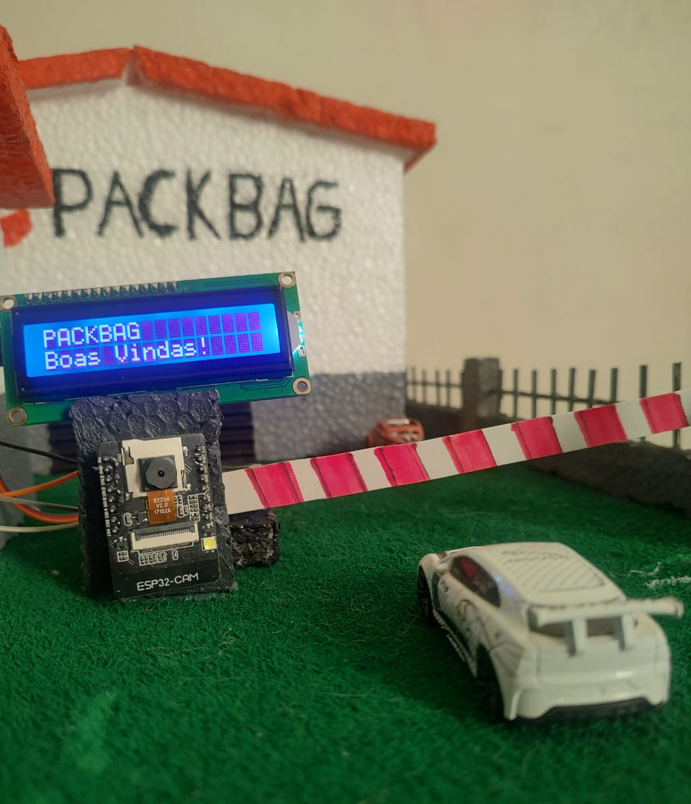
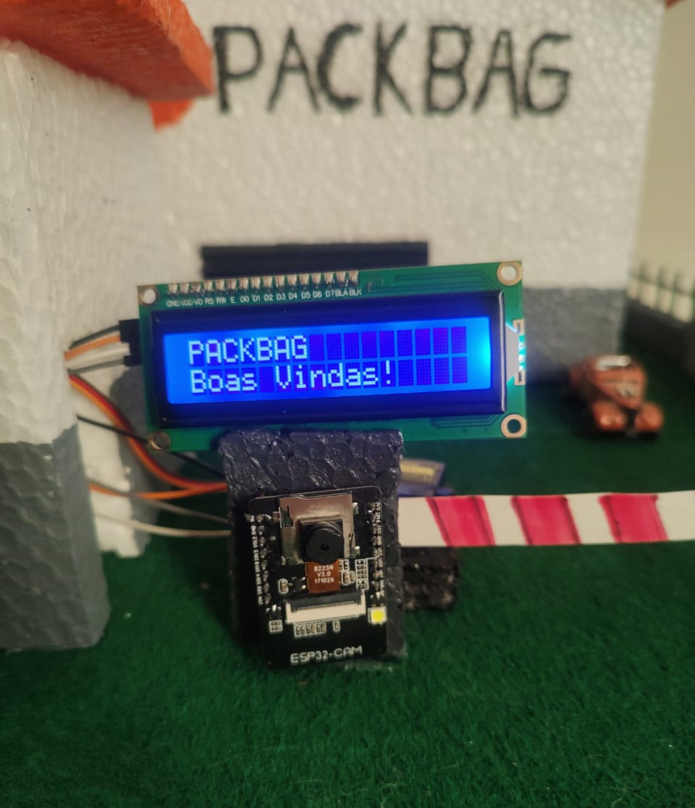
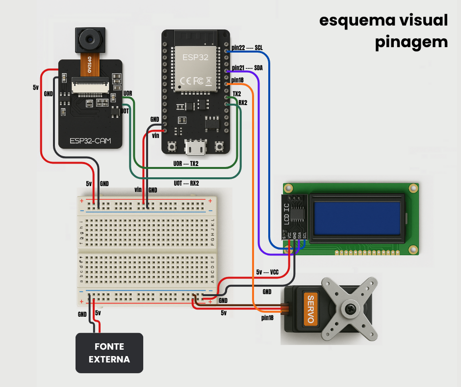

# Leitor de Placas Veiculares com IA
Sistema de leitura automática de placas de veículos utilizando visão computacional e dispositivos IoT com ESP32 e ESP32-CAM.

<!-- Bagdes informando visualmente as tecnologias utilizadas -->


## 🌟 INTRODUÇÃO
Este projeto realiza a identificação de placas veiculares em tempo real utilizando **visão computacional**. Basta conectar qualquer câmera com suporte a streaming — seja via cabo ou pela rede — para que a Inteligência Artificial reconheça as placas automaticamente.

O sistema foi desenvolvido como parte do curso de **Análise e Desenvolvimento de Sistemas (ADS)** da **UNIFEOB (Centro Universitário da Fundação de Ensino Octávio Bastos)**, tendo como objetivo atender a uma **necessidade real da empresa PackBag**, que buscava automatizar o controle de entrada e saída de caminhões.

Como solução, desenvolvemos um protótipo utilizando os microcontroladores **ESP32** e uma **ESP32-CAM**, para a detecção visual utilizamos **OpenCV** e **YOLOv8n**, além do **EasyOCR** para extração dos textos das placas. O projeto simula com sucesso o processo de automação necessário resolvendo o problema da empresa.

## 🎯 CONTEXTO
A faculdade **UNIFEOB** firmou uma parceria com a empresa **PackBag** com o objetivo de promover sua transformação rumo à **Indústria 4.0**. A partir dessa colaboração, foram identificados diversos pontos de melhoria nos processos internos da empresa, que se tornaram **desafios reais a serem solucionados pelos alunos**.

Este projeto surgiu dentro desse contexto, como parte do Projeto Integrador (PI) do primeiro bimestre, dentro de diversas propostas nossa equipe foi responsável por desenvolver uma **solução tecnológica para automatizar o controle de entrada e saída de caminhões** no centro de distribuição da PackBag.

Através da análise de empresas do mesmo setor e do levantamento de informações com **as personas** envolvidas no processo (motoristas, funcionários da portaria e gestores), identificamos as principais dores enfrentadas na rotina operacional:

- 🔄 Baixa eficiência no fluxo de entrada e saída de veículos

- 👥 Falhas na contagem manual de caminhões

- 🔓 Brechas de segurança no controle de acesso

- 🕒 Atrasos logísticos recorrentes

- 🐢 Falta de agilidade na liberação de veículos

Com base nessas informações, desenvolvemos uma solução que não só atende às demandas da empresa, como também melhora a experiência dos caminhoneiros tornando o processo mais ágil, seguro e automatizado para todos os envolvidos.

Nosso foco foi trabalhar com **protótipos funcionais**, capazes de **demonstrar à empresa a viabilidade da solução** e conquistar sua validação. Por esse motivo, optamos pelo uso do **ESP32** e da **ESP32-CAM**, que além de oferecerem baixo custo e conectividade wireless, também permitiram alinhar o projeto ao conteúdo estudado nas disciplinas do curso.

## ⚙ FUNCIONALIDADES

### 📸 Leitura de placas em tempo real
Detecta veículos por meio da câmera (ESP32-CAM) e utiliza o OpenCV para **identificar as placas** no momento da captura.

### 🧠 Reconhecimento com IA
Integra o modelo YOLO para a detecção de veículos e o EasyOCR para a **extração dos caracteres das placas**.

### 📋 Registro de acessos
Armazena os **dados das placas** detectadas, juntamente com **a data e hora da leitura**, em um arquivo JSON
*(com possibilidade de integração futura com banco de dados)*.

### 🌐 Interface Web
Painel acessível via navegador, que exibe a transmissão da câmera e os registros capturados. A interface apresenta:
- Placas detectadas.
- Veículos autorizados e não autorizados.
- Horário da detecção.
- Horário da liberação.
- Botões para abertura e fechamento do portão.

### 🚪 Simulação de abertura de portão
Controla um **servo motor** conectado ao ESP32 para simular a liberação do acesso.

## 🎞 MÍDIAS

<!-- Fotos e Gifs do projeto -->









## 💻 STACK DE TECNOLOGIAS

### 🐍 Python
Linguagem principal do backend. O Python atua como o **administrador** do sistema, sendo responsável por capturar as imagens da câmera, processá-las por meio das **três bibliotecas de IA (OpenCV, YOLOv8n e EasyOCR)**, além de gerenciar a comunicação entre os microcontroladores e a interface utilizada pelo porteiro.

### 👁 OpenCV <sub>IA</sub>
Biblioteca de visão computacional usada para **ler o vídeo em tempo real da ESP32-CAM**, aplicar filtros e preparar as imagens para as etapas seguintes de detecção. Também é responsável por exibir as marcações visuais quando uma placa é identificada.

### 👨‍⚖️ Yolov8n <sub>IA</sub>
Modelo de IA responsável por **detectar e localizar as placas veiculares** na imagem. Sem o YOLO, o sistema não conseguiria distinguir a placa do restante do cenário. Utiliza um modelo pré-treinado chamado ```license_plate_detector.pt```, adaptado para reconhecer diversos padrões de placas ao redor do mundo.

### 🆎 easyOCR <sub>IA</sub>
Após a detecção da placa, o EasyOCR realiza a **leitura óptica dos caracteres**, convertendo a imagem em texto. Ele permite extrair a numeração da placa para realizar a verificação no banco de dados — no nosso caso no JSON.
Está configurado para reconhecer **os padrões de placas brasileiras**, tanto o modelo antigo quanto o novo padrão MERCOSUL.

### 🌐 Flask
**Framework web** leve utilizado para criar o servidor backend. É responsável por **gerenciar as rotas HTTP** e servir a interface web, onde o porteiro pode visualizar as capturas, status de liberação, horários e acionar o portão.

### 👨‍💻 Arduino IDE
Ambiente de desenvolvimento utilizado para **escrever e enviar os firmwares** aos microcontroladores ESP32 e ESP32-CAM. Também facilita o uso do monitor serial para debugar e obter dados importantes, como IPs e logs de comunicação.

### ⌨ C/C++
Linguagens utilizadas para programar os firmwares dos microcontroladores (ESP32 e ESP32-CAM), definindo o comportamento dos dispositivos de forma eficiente e com controle direto do hardware.

### 🤖 ESP32
Microcontrolador principal do projeto. Responsável por:

- Exibir mensagens no **Display LCD** para os motoristas.
- Controlar o **Servo Motor** que simula a abertura do portão.
- Alimentar e se comunicar com a ESP32-CAM.

A escolha do ESP32 foi estratégica por oferecer **maior poder de processamento** e **conectividade Wi-Fi integrada**, com excelente custo-benefício em comparação ao Arduino tradicional.

### 📷 ESP32-CAM
Versão do ESP32 com módulo de câmera integrado. Foi usada para **captura e transmissão ao vivo das imagens** em alta performance, com suporte a múltiplas resoluções.
Ideal para prototipagem de baixo custo, essa placa também inclui **suporte a webserver**, tornando-a perfeita para sistemas embarcados com transmissão em tempo real.

### 🔌 Servo Motor
Dispositivo eletromecânico utilizado para **simular a abertura e fechamento do portão**. Recebe sinais do ESP32 e executa movimentos precisos de rotação, representando a liberação ou bloqueio da entrada de veículos.

### 📟 Display LCD I2C
Display de baixo consumo que utiliza o protocolo I2C para comunicação com o ESP32. Foi utilizado para **exibir mensagens diretamente aos motoristas**, como autorizações, alertas e instruções rápidas de acesso.


## 🛠 GUIA DE CONFIGURAÇÃO E INSTALAÇÃO

Este guia fornece instruções para clonar o repositório, instalar as dependências necessárias, configurar os dispositivos e preparar o ambiente para execução do sistema.

### 📥 Clonando o Repositório

```bash
git clone https://github.com/GuiMorus/Projeto-Leitor-de-Placas-Veiculares.git
cd Projeto-Leitor-de-Placas-Veiculares
```

---

### 📦 Instalação das Dependências Python

> ❌ **IMPORTANTE**: Se você for usar o PyTorch com suporte a CUDA, instale o CUDA **antes** das dependências para garantir compatibilidade.

#### (Opcional) Instalação do PyTorch com CUDA

```bash
pip3 install torch torchvision torchaudio --index-url https://download.pytorch.org/whl/cu128
```
❗ *verifique qual versão do CUDA está utilizando e acesse a [página do pytorch](https://pytorch.org/get-started/locally/) para garantir o pip install correto da sua versão do CUDA*

#### Instalação das Demais Dependências

Recomenda-se criar um ambiente virtual:

```bash
python -m venv venv
source venv/bin/activate  # Linux/macOS
venv\Scripts\activate    # Windows
```

Instale as bibliotecas:

```bash
pip install -r requirements.txt
```

---

### ⚡ Conexões e Pinagem do Hardware

- **ESP32 alimenta ESP32-CAM** pelos pinos **Vin** (5V) e **GND** (Terra).
- **RX2 (GPIO16)** da ESP32 conectado ao pino **TX (UOT)** da ESP32-CAM (comunicação Serial).
- **TX2 (GPIO17)** da ESP32 conectado ao pino **RX (UOR)** da ESP32-CAM (comunicação Serial).
- **Pino 21 (GPIO21)** da ESP32 -> **SDA** do display LCD
- **Pino 22 (GPIO22)** da ESP32 -> **SCL** do display LCD
- **Pino 18 (GPIO18)** da ESP32 -> controle do **Servo Motor**
- ❕ Velocidade da conexão: 115200 baud.



> 🔌 O **Servo Motor** e o **Display LCD I2C** devem ser alimentados por uma **fonte externa de 5V** independente da ESP32 e da ESP32-CAM.

*OBS: minha equipe fez um adaptador cortando um cabo USB, pegamos o fio vermelho (5V) e o fio preto (GND/Terra) e conectamos em vias separadas na protoboard. O USB é conectado em uma porta do computador fornecendo a energia e amperagem necessárias.*

---

### 🌐 Conectividade de Rede

Para que o sistema funcione corretamente:

- A **ESP32**, **ESP32-CAM**, **api_flask.py** e **main.py** devem estar conectados à **mesma rede Wi-Fi**.
- O IP da ESP32 será exibido no **display LCD** e no **Serial Monitor**.
- O IP da ESP32-CAM aparecerá no **Serial Monitor** após o boot.

> ⚠️ **IMPORTANTE**: Certifique-se de atualizar os IPs nas variáveis do código ou o projeto não funcionará.
> - em **main.py** modifique o **IP da ESP32-CAM na linha 12**.
> - em **main.py** modifique o **IP da ESP32 na linha 13**.
> - em web > **index.html** modifique o **IP da ESP32 na linha 27**.
> - em code > ESP32_LCD > **ESP32_LCD.ino** modifique o **SSID e Passeord da ESP32 na linha 7 e 8**.
> - em code > ESPCAM_CameraWebServer > **ESPCAM_CameraWebServer.ino** modifique o **SSID e Passeord da ESP32 na linha 31 e 32**.

---

Pronto! Com isso seu ambiente estará configurado para execução o código com eficiência. Na próxima seção traremos as instruções de uso e exemplos.


## 🚀 INSTRUÇÕES DE USO

Após montar todo o circuito e instalar corretamente as bibliotecas e dependências, é hora de colocar o projeto em funcionamento! Siga os passos abaixo conforme os módulos:

### 🔧 Configurando o ESP32

1. **Abra o Arduino IDE** e configure a placa ESP32:

   - Vá em:  
     `Arquivo > Preferências > Additional Boards Manager URLs`  
     Adicione o seguinte link:  
     `https://raw.githubusercontent.com/espressif/arduino-esp32/gh-pages/package_esp32_index.json`

2. **Instale as bibliotecas necessárias** no Arduino IDE:
   - `LiquidCrystal I2C` (por *Frank de Brabander*)
   - `ESP32Servo` (por *Kevin Harrington, John K. Bennett*)

3. **Instale a placa ESP32** em:  
   `Ferramentas > Placa > Gerenciador de Placas`  
   Procure por **ESP32** e instale a biblioteca da Espressif e da Arduino para ESP.

4. **Conecte o ESP32 ao computador** via USB.

5. Em:  
   `Ferramentas > Placa` selecione: **ESP32 Dev Module**  
   Em:  
   `Ferramentas > Porta` selecione a **porta COM correta**.

6. **Abra e faça upload do código**:
   ```
   ./Projeto-Leitor-de-Placas-Veiculares/code/ESP32_LCD/
   ```

---

### 📷 Configurando a ESP32-CAM

> ⚠️ A biblioteca depende do modelo da sua ESP32-CAM. O código fornecido é genérico, mas pode ser ajustado conforme necessário.

1. **Conecte sua ESP32-CAM ao PC com adaptador USB-serial.**

2. No Arduino IDE:
   - Vá em `Arquivo > Abrir`
   - Selecione a pasta:
     ```
     ./Projeto-Leitor-de-Placas-Veiculares/code/ESPCAM_CameraWebServer/
     ```

3. Selecione a placa correspondente (geralmente: **AI Thinker ESP32-CAM**)  
   e a **porta COM correta**, e então faça o upload do código.

---

### 🌐 Iniciando a API Flask

1. Abra o terminal (CMD, PowerShell ou bash).

2. Navegue até a pasta raiz do projeto:
   ```bash
   cd Projeto-Leitor-de-Placas-Veiculares
   ```

3. Execute o servidor Flask:
   ```bash
   python api_flask.py
   ```

---

### 🚀 Etapas Finais para Rodar o Sistema

1. **Ligue a fonte de alimentação** dos dispositivos (Servo Motor e Display LCD).

2. **Conecte o USB** do ESP32 ao PC.

3. **Verifique os IPs no Serial Monitor** da Arduino IDE (velocidade: **115200 baud**):
   - O IP da ESP32 será exibido no Display LCD e no Serial Monitor.
   - O IP da ESP32-CAM também será mostrado.

4. **Acesse o IP da ESP32-CAM** no navegador:
   - Faça as configurações de **resolução**, **qualidade** e **filtros**.
   - ⚠️ Recomendação: utilize **filtro preto e branco (grayscale)** para melhorar a leitura da IA.
   - Após configurar, clique em **"Stop Stream"** para evitar conflito com o `main.py`.

5. **Execute o script principal**:
   ```bash
   python main.py
   ```

6. **Acesse a interface Web** no navegador:
   ```
   http://localhost:5000/
   ```
   Lá você poderá visualizar:
   - Placas detectadas em tempo real.
   - Status de liberação de veículos.
   - Horários de detecção.
   - Botões para abrir e fechar o portão remotamente.

## 💡 Exemplos de Uso

Abaixo estão alguns cenários que demonstram como o sistema pode ser utilizado na prática dentro de ambientes reais ou simulados:

### 🚛 Entrada de Caminhão Autorizado

1. O caminhão se aproxima da entrada da empresa.
2. A câmera (ESP32-CAM) detecta o veículo e envia o vídeo em tempo real.
3. O sistema com YOLO identifica a presença da placa e recorta a imagem.
4. O EasyOCR interpreta os caracteres da placa.
5. O sistema consulta o JSON com as placas autorizadas.
6. **Se a placa estiver liberada**:
   - O servo motor simula a abertura do portão.
   - A mensagem “Entrada liberada” aparece no LCD.
   - O evento é registrado no histórico com data e hora.
   - A interface web mostra a placa, o status e permite nova interação.

---

### 🚫 Veículo Não Autorizado

1. O veículo é detectado normalmente pelo sistema.
2. A leitura da placa é feita com sucesso.
3. A verificação no banco de dados **não encontra correspondência**.
4. O portão **permanece fechado**.
5. O LCD exibe “Acesso negado”.
6. O evento é registrado como tentativa de acesso.
7. Na interface web, é possível visualizar a placa negada com horário e tomar uma ação manual se necessário.

---

### 🧪 Cenário de Teste / Simulação

Ideal para demonstrações acadêmicas ou apresentações à empresa.

1. O sistema é iniciado em modo simulado (com ESPs conectadas, mas sem tráfego real).
2. Utilizando vídeos gravados ou simulação via câmera, o sistema é testado com diferentes placas.
3. É possível mostrar:
   - A detecção visual em tempo real.
   - A precisão da leitura OCR.
   - A automação da liberação com o servo motor.
   - A interface web com logs e botões de controle.

---

### 🕵️‍♂️ Monitoramento de Frota

1. A empresa deseja manter um controle de todos os caminhões que entram e saem.
2. O sistema registra todas as placas detectadas, mesmo as negadas.
3. O JSON pode ser exportado ou conectado a um banco de dados para relatórios mais completos.
4. Facilita o rastreio de horários e movimentações.

## 📈 CONCLUSÕES

Posso dizer que esse foi o maior projeto que desenvolvi até agora *(junho/2025)* — e sem dúvidas, um dos maiores desafios também. Fiquei mega empolgado quando entrei na faculdade e soube que a cada semestre iríamos criar projetos diferentes. Eu sou mais do estilo "mão na massa", e tudo superou minhas expectativas quando descobri que o projeto desenvolvido seria para **resolver uma necessidade real de uma empresa real**.

Há tempos venho **estudando Python**, me especializando na linguagem, e meu desejo de trabalhar com Inteligência Artificial finalmente pôde ser colocado em prática neste projeto. Confesso que foram dias e noites seguidas ajustando cada parte do sistema: escrevendo códigos, testando, errando e corrigindo até chegar na versão final.

Além de mergulhar no **universo do IoT** e entender como transformar uma empresa em uma verdadeira indústria 4.0, trabalhar em equipe foi essencial. Recebi ideias, suporte e apoio em momentos cruciais para tomar decisões sobre o sistema, construir a interface no Figma, organizar toda a documentação e montar o protótipo completo para apresentar um PMV (Produto Mínimo Viável) para a **Pack Bag**. Sem minha equipe, com certeza ainda estaria montando esse protótipo até hoje — e ele não teria chegado nem perto do que conseguimos entregar juntos.

Depois de muito trabalho, pesquisas sobre sistemas semelhantes e conversas com as personas envolvidas para entender suas dores e necessidades reais, conseguimos desenvolver o que queríamos: **um Leitor de Placas Veiculares com uso de IAs que funciona totalmente offline**, sem depender de APIs externas ou de simplesmente copiar e colar um projeto pronto da internet, na verdade posso dizer com orgulho que tudo foi codigicado do zero. Atendemos aos requisitos da empresa, apresentamos a solução, tivemos um excelente feedback e nos disseram que a aplicação é extremamente viável, já que a empresa possui todos os dados e estrutura para aplicar o sistema na prática.

## 🤝 AUTORES

Apresento os membros do **Grupo 9 - Turma B da UNIFEOB 2025** que fez este projeto ser uma realidade.

### Guilherme Moreira (eu)
- Responsável pela programação em Python.
- Integração e comunicação entre as Inteligências Artificiais.
- Funcionamento dos microcontroladores ESP32 e ESP32-CAM.
- Auxílio na construção da maquete.

> [GitHub](https://github.com/GuiMorus)
> [LinkedIn](https://www.linkedin.com/in/gui-msilva/)

---

### Ester de Lima Machado
- Responsável pela edição de vídeos e imagens das mídias do grupo.
- Auxílio na montagem do hardware dos microcontroladores.
- Participação na produção da maquete.

> [LinkedIn](https://www.linkedin.com/in/exxther/)

---

### Helloisa Dias Francisco
- Responsável pela apresentação final para a Pack Bag.
- Produção das documentações e pesquisas do projeto.
- Roteirizou o podcast em vídeo e a apresentação oficial.
- Participação na produção da maquete.

---

### Maria Fernanda de Almeida
- Líder do grupo.
- Responsável pela criação da interface e protótipo no Figma.
- Organização das tarefas do grupo via Trello.

---

### Sandy de Souza Lima
- Responsável pela logística do sistema.
- Auxílio na montagem do hardware dos microcontroladores.
- Participação na produção da maquete.

---

### Vitória Kamilly da Silva Oliveira
- Curadoria e edição final dos documentos conforme as normas ABNT.
- Organização da documentação oficial e entregas acadêmicas.
- Auxílio na construção da interface e protótipo no Figma.

## 🙏 AGRADECIMENTOS

Gostaria de agradecer primeiramente a minha equipe, que deu toda a estrutura e se esforçaram pro projeto ser uma realidade, por terem aguentado meus surtos, audios e desespero a cada erro que aparecia nos códigos😆.

Deixo aqui meus agradecimentos à **UNIFEOB** por proporcionar uma experiência tão completa, junto com a **empresa Pack Bag**, nos dando a oportunidade de trabalhar em soluções reais que podem impactar diretamente a vida de diversos motoristas e trabalhadores.

Sem sombra de dúvidas, esse projeto foi extremamente enriquecedor para mim. Aprendi muita coisa em um curto período de tempo e me dediquei ao máximo para criar um sistema totalmente funcional, com potencial para ser melhorado e, o mais importante, aplicado na empresa o quanto antes.

Agradeço também aos **docentes do nosso módulo de IoT**, que sempre nos orientaram, correram atrás do que precisávamos e acompanharam de perto a evolução do projeto. Estiveram presentes, tirando dúvidas mesmo fora do horário de aula, e foram fundamentais para o aprimoramento do sistema.

E por último, mas não menos importante, **a você** — que tirou um tempo para conhecer esse projeto. Espero que ele sirva como ponto de partida para seus próprios estudos, te inspire a criar algo ainda melhor ou até mesmo te ajude a desenvolver seu projeto da faculdade.

**Muito obrigado a todos!**
